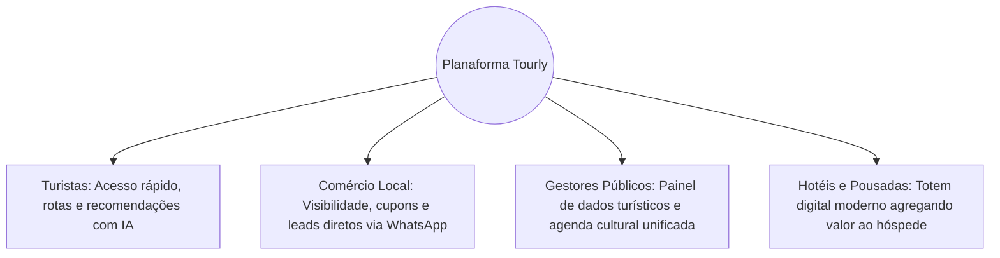

# Modelo de Negócios - Tourly

> **Versão:** 1.0.0  
> **Status:** Em Planejamento

---

## 💳 1. Estrutura de Monetização (SaaS)

O **Tourly** opera em um modelo **B2B / B2G (Business-to-Government / Business-to-Business)** com assinaturas mensais recorrentes para empresas locais e contratos institucionais com prefeituras ou associações de turismo.

### Planos de Assinatura para Estabelecimentos Comerciais

| Plano | Valor Mensal | Recursos Incluídos |
| :--- | :--- | :--- |
| **Básico** | **R$ 79,00 / mês** | - Perfil da empresa (Fotos, Horários, Endereço, Contato) - Presença no Portal Web, PWA e Totens do município - Link direto para WhatsApp |
| **Profissional** | **R$ 149,00 / mês** | - Todos do plano Básico - Publicação de Promoções e Cupons de Desconto - Divulgação de Eventos próprios - Relatório básico de acessos e cliques |
| **Destaque** | **R$ 299,00 / mês** | - Todos do plano Profissional - Posicionamento prioritário nos Totens e no topo das pesquisas - Destaque em campanhas sazonais da cidade - Analytics avançado de conversão e rotas |

---

## 🏛️ 2. Modelo Institucional (Prefeituras e Secretarias)

Para prefeituras e secretarias de turismo, o Tourly é comercializado como um software de gestão pública turística por meio de contratos de licença SaaS pública:
- **Plano Município Essencial**: Taxa de setup + assinatura anual cobrindo a gestão de totens públicos, aplicativo oficial da cidade e painel de indicadores turísticos.
- **Venda / Locação de Totens**: Parceria de hardware com fornecedores homologados para instalação de totens touchscreen em hotéis, pousadas, aeroportos e postos de informação.

---

## 📊 3. Proposta de Valor por Segmento

