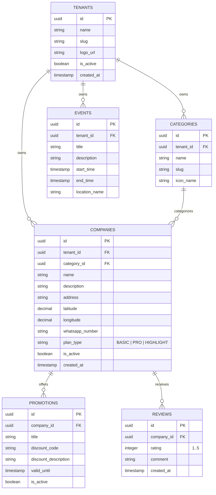

# Modelo de Banco de Dados - Tourly

> **SGBD:** PostgreSQL 16  
> **Estratégia:** Multi-Tenant via `tenant_id`

---

## 📐 Diagrama Entidade-Relacionamento (ERD)

```mermaid
erDiagram
    TENANTS ||--o{ COMPANIES : owns
    TENANTS ||--o{ CATEGORIES : owns
    TENANTS ||--o{ EVENTS : owns
    CATEGORIES ||--o{ COMPANIES : categorizes
    COMPANIES ||--o{ PROMOTIONS : offers
    COMPANIES ||--o{ REVIEWS : receives

    TENANTS {
        uuid id PK
        string name
        string slug
        string logo_url
        boolean is_active
        timestamp created_at
    }

    CATEGORIES {
        uuid id PK
        uuid tenant_id FK
        string name
        string slug
        string icon_name
    }

    COMPANIES {
        uuid id PK
        uuid tenant_id FK
        uuid category_id FK
        string name
        string description
        string address
        decimal latitude
        decimal longitude
        string whatsapp_number
        string plan_type "BASIC | PRO | HIGHLIGHT"
        boolean is_active
        timestamp created_at
    }

    EVENTS {
        uuid id PK
        uuid tenant_id FK
        string title
        string description
        timestamp start_time
        timestamp end_time
        string location_name
    }

    PROMOTIONS {
        uuid id PK
        uuid company_id FK
        string title
        string discount_code
        string discount_description
        timestamp valid_until
        boolean is_active
    }

    REVIEWS {
        uuid id PK
        uuid company_id FK
        integer rating "1..5"
        string comment
        timestamp created_at
    }
```
